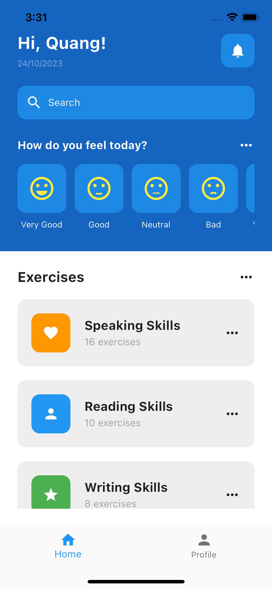

# Mental Health App

//iphone 14 size


## Description

The Mental Health App is a Flutter application designed to provide support and resources for mental health management.

## Installation

1. Clone the repository:

   ```bash
   git clone https://github.com/your-username/mental-health-app.git
   ```

2. Install the dependencies:

   ```bash
    flutter pub get
   ```

3. Run the app:

   ```bash
    flutter run
   ```

## Technologies

- Flutter
- Dart
